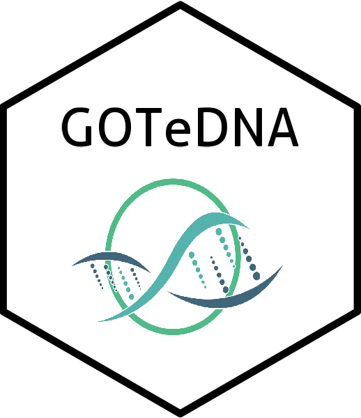

<!-- badges: start -->

[](https://tidyverse.org/lifecycle/#maturing)
[](http://www.repostatus.org/#active)
[](/commits/master)
<!-- badges: end -->

# GOTeDNA <a href='https://thierrygosselin.github.io/gotedna/'></a>

**GOTeDNA: an R package for guidance on optimal DNA sampling periods to
develop, optimize, and interpret monitoring programs**

## Installation

To try out the dev version of **gotedna**:

``` r
if (!require("devtools")) install.packages("devtools")
devtools::install_github("thierrygosselin/gotedna")
library(gotedna)
```

## R functions categories:

- Import data
- Clean/tidy data
- Visualization
